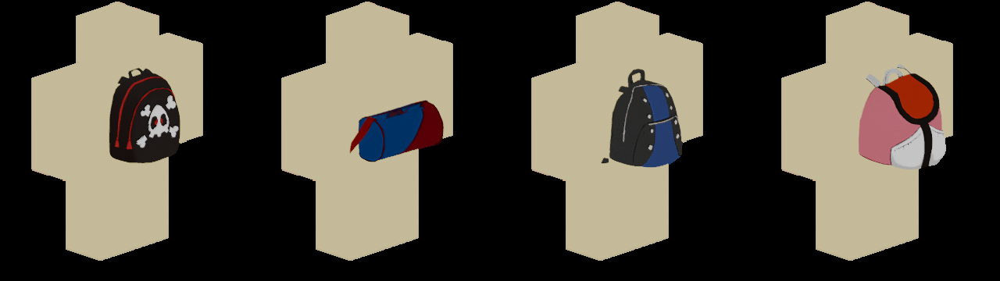

# Zaini per rig R6 di Roblox



Quattro zaini (zaino2–zaino5) scalati, orientati e rigati sulla base del rig R6 di Roblox
(Torso 2×2×1 stud, personaggio rivolto verso −Z in Roblox / −Y in Blender).
Ogni zaino sta sulla schiena del Torso, con gli spallacci che rientrano nel busto.
Lo zaino3 (borsone) sta orizzontale sulla parte bassa della schiena.

| Zaino | Dimensioni (stud, L×A×P) | Triangoli |
|-------|-------------------------|-----------|
| zaino2 | 1.77 × 1.90 × 1.48 | 2896 |
| zaino3 | 2.10 × 1.03 × 1.60 | 2298 |
| zaino4 | 2.14 × 1.90 × 1.50 | 2752 |
| zaino5 | 1.86 × 1.90 × 2.05 | 2813 |

## File

| File | Che cos'è |
|------|-----------|
| `zainoN_accessory.fbx` | Mesh rigido centrato: per creare un **Accessory** R6 (consigliato) |
| `zainoN_R6_rigged.fbx` | Mesh skinnato al 100% sull'osso `Torso` di un'armatura R6 (`HumanoidRootPart` → `Torso` → `Head`, `Left/Right Arm`, `Left/Right Leg`) |
| `zainoN_R6.blend` | Scena Blender con armatura R6 e zaino già posizionato (texture incluse) |
| `zainoN_Color.png`, `zainoN_Normal.png` | Texture 1024×1024 (colore e normal map) |
| `CreaAccessoriZaini.lua` | Script per la Command Bar di Studio che crea gli Accessory |

Tutti i file usano 1 unità = 1 stud.

## Usarli come accessori R6 (metodo consigliato)

Su R6 gli zaini funzionano come Accessory agganciati al `BodyBackAttachment` del Torso,
così seguono il personaggio in tutte le animazioni.

1. In Studio apri **3D Importer** e importa i quattro `zainoN_accessory.fbx`
   (imposta **Scale Unit / File Dimensions = Stud**).
2. Esegui `CreaAccessoriZaini.lua` nella **Command Bar**.
   Crea `ReplicatedStorage.Zaini` con gli Accessory `Zaino2`…`Zaino5`, con misure e attachment già impostati.
3. Per farli indossare ai giocatori, usa uno Script in `ServerScriptService`:

```lua
local Players = game:GetService("Players")
local Zaini = game:GetService("ReplicatedStorage"):WaitForChild("Zaini")

Players.PlayerAdded:Connect(function(player)
	player.CharacterAdded:Connect(function(character)
		local humanoid = character:WaitForChild("Humanoid")
		humanoid:AddAccessory(Zaini.Zaino2:Clone())
	end)
end)
```

## Usare la versione rigata

`zainoN_R6_rigged.fbx` contiene l'armatura con i nomi delle parti R6 e lo zaino pesato sul `Torso`.
Serve se vuoi animarlo o modificarlo in Blender insieme a un rig R6, oppure importarlo in Studio
come modello rigato (opzione **Rig General**). Nei giochi, però, R6 usa i Motor6D e non le ossa,
quindi per indossarlo conviene la versione Accessory qui sopra.

## Se qualcosa non torna

- **Zaino al contrario** (davanti invece che dietro): nel `Handle` dell'Accessory ruota
  l'attachment `BodyBackAttachment` di 180° su Y (`Orientation = 0, 180, 0`) e inverti il segno Z della sua `Position`.
- **Zaino troppo grande o piccolo**: lo script imposta già `Size`, ma puoi cambiarla a piacere
  (se lo ingrandisci, sposta l'attachment in proporzione).
